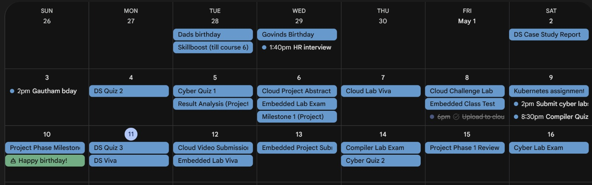
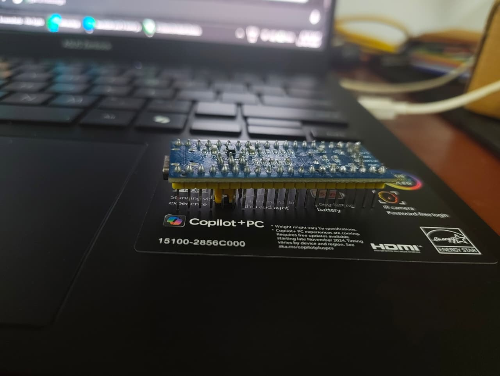
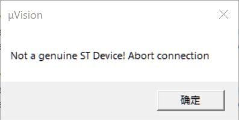
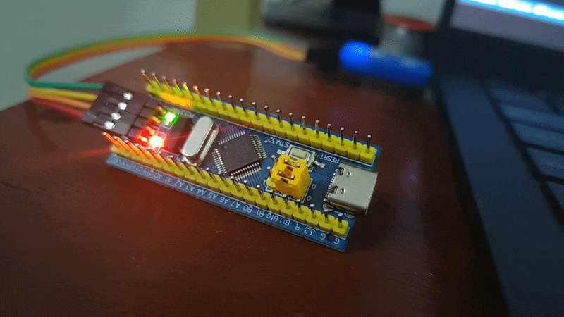

For our embedded systems course this semester we were given two choices --- either use a simulator or actually build a project using hardware.

Now, let me set the scene:

All of this was scheduled right before our finals. Any sane individual would have chosen the simulator, however as you could probably guess by the length of this blog, I am not a very sane individual :)

## The Hardware
Given the time constraints, I picked the simplest thing I could think of: read temperature and humidity from a DHT11 sensor and display it on a tiny OLED.

If you have any experience with electronics, this is a pretty beginner friendly project, or so I thought..

You see, my prior experience with embedded electronics were confined to the comforts of the Arduino ecosystem with its easy to understand IDE. However, for this project, we were required to use an ARM STM32 microcontroller, that too without any of the higher level abstractions (HAL).

This meant that I had to do raw register manipulation and directly write C code for everything. Now, granted, we did learn most of this stuff during our course. However, we used the `STM32F446RE` Nucelo Board, a board which costs around 2k INR. 

Me being the cheapskate that I am, decided to opt for an `STM32F103C8T6` board instead. This board only costed only around 200 INR, 10x decrease! I casually read through the specs and naively assumed that since this board used the same ARM Cortex architecture that the Nucleo board uses, it wouldn't pose any problems.

Boy, was I wrong.

## The Beginning Of My Woes

I ordered the board from Amazon, and it arrived with the header pins separately. I expected this, so I took out my borrowed soldering iron and began soldering the pins onto the board. 

> 

After this, I hooked up the ST-Link programmer to the board. Installed the ARM Keil IDE and started writing code for a simple LED blink script (the hello world of electronics!).

That's when my electronics illiterate brain realized, since this is a different chip, the pinouts and registers are different than what I'm used to. Cue me slogging through the schematic and a 1,000 page reference manual to figure out which pin the onboard LED is connected to and which bits to set in the register. 

After I was done writing the code, I successfully built it and tried to upload it to my board. That's when I got this magnificent error:

> 

## The Chinese Counterfeit Strikes Again
Suffice to say, I was pretty cooked at this point, the official IDE was claiming that I was using a cloned chip and refused to flash it. I poked around a bit and managed to find the [`IDCODE`](https://developer.arm.com/documentation/100230/0100/Debug-Access-Port/DAP-register-descriptions/Debug-port-registers/Identification-Code-register--IDCODE)  of the chip, it was `0x2BA01477` which was not the ID of an original `STM32F103C8T6`.

I did some research and managed to find this [article](https://hackaday.com/2020/10/22/stm32-clones-the-good-the-bad-and-the-ugly/).  They had mentioned the exact same chip ID, confirming that this was indeed a chinese clone. The real name of this cuckoo was in fact `CS32F103`. The only thing betraying it was the `IDCODE` as the markings on the IC itself were identical to the original chip. 

One thing I found particularly amusing was that the company which cloned this chip did such a good job that they even fixed some of the errata listed in the original ST datasheet. Imagine that, a counterfeit was in some small way better than the original. 

Merely knowing that the chip was a clone wasn't of much help though. I couldn't find any good resources on Google with instructions on how to get around the IDE lockout. 

## The Workaround
With the help of Claude, I managed to unearth two ancient articles. The first one was the [documentation](https://docs.powerwriter.com/en/docs/next/faq/powerwriter/base/debug_question/#device_mismatch) of some Chinese embedded tools company? And the second was a blogger [article](https://akashbuilts.blogspot.com/2018/03/how-to-download-older-version-of-keil.html?sc=1778517783817#c2168333006503556742) from 8 years ago that explained how to download an older version of the IDE (this will become relevant soon). 

The Chinese site somehow had an unofficial IDE pack for the `CS32F103`, I could not find this on the internet anywhere else and frankly I have no idea how they even got their hands on it. 

Unfortunately, the patch was incompatible with the latest version of the IDE. The solution is simple enough, just download an older version. However, Keil in all their glory have gone out of their way to make this as difficult as possible.

Remember that 8-year-old blogger article from earlier? That was the only working method I could find, the author had conveniently left an expired product key for the IDE and possesing such a key was the only way to access old versions. 

## The (blinking) light at the end of the tunnel
Finally, after installing an archaic version of the IDE and installing a shady patch from a Chinese website, I was able to flash my board.

All of this work, just to get an LED to blink. Words couldn't describe how satisfied I felt at that moment, this satisfaction was however pretty short lived, because that's when I remembered---I hadn’t even started work on the actual project....
